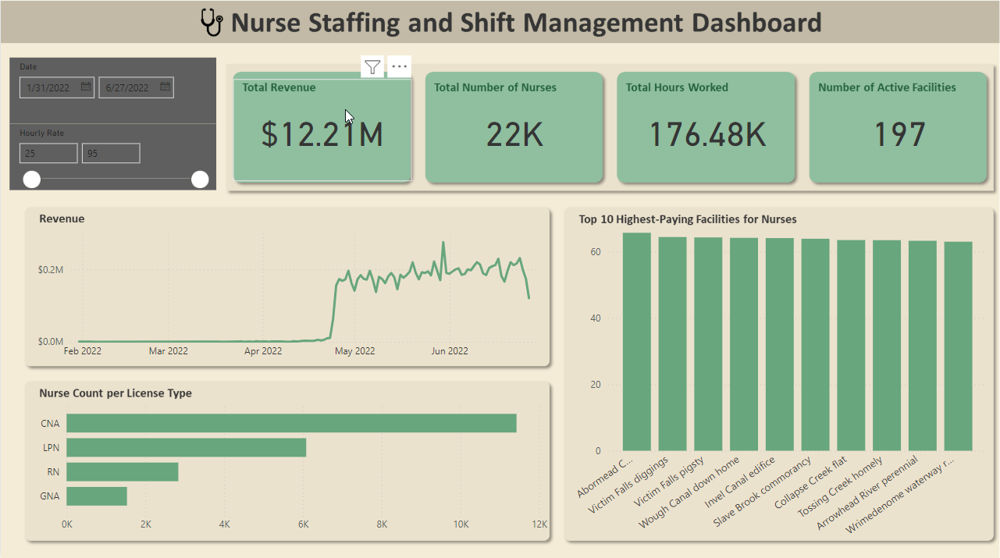

# Healthcare Staffing Data Analysis


This project utilizes SQL to process and analyze healthcare staffing data. The process involves cleaning, standardizing, and transforming nurse staffing records, with a focus on timecard entries, billing information, and shift details. The transformed data is then visualized and analyzed using Power BI.

&nbsp;
## Table of Contents
- Features
- Database Structure
- Data Processing Steps
- Setup Instructions
- SQL Operations

&nbsp;
## Features
- Data staging and transformation
- Column standardization and renaming
- Duplicate record checking
- Null value handling
- Automated calculations for missing billing and payment data

&nbsp;
## Database Structure
### Main Tables
  - staffing (original table)
  - staffing_staging (processed table)

### Key Fields
  - State
  - Facility name
  - Nurse information
  - Timecard details
  - Billing information
  - Shift data

&nbsp;
## Data Processing Steps
1. Staging Table Creation
    ```
    CREATE TABLE staffing_staging LIKE staffing;
    ```
2. Data Cleanup
    * Removal of unnecessary columns
    * Standardization of column names
    * Null value handling
3. Column Renaming
    * Conversion to snake_case
    * Removal of spaces and special characters
    * Standardization of naming conventions
4. Data Validation
    * Duplicate record checking
    * Null value identification
    * Data consistency verification
5. Automated Calculations
    * Total bill computation for missing values
    * Total pay calculations based on hourly rates
      
&nbsp;  
## Setup Instructions
1. Create a MySQL database named 'healthcare'
  ```
  CREATE DATABASE healthcare;
  ```
2. Execute the data cleaning script
3. Verify the data processing results

&nbsp;  
## SQL Operations
### Column Cleanup
   
    ALTER TABLE staffing_staging
    DROP COLUMN `Facility Payment method`,
    DROP COLUMN `Processing Fee (Facility Payment method)`;

### Data Standardization
    ALTER TABLE staffing_staging
    DROP COLUMN `Facility Payment method`,
    DROP COLUMN `Processing Fee (Facility Payment method)`;
    -- Additional column renaming...

### Missing Value Calculations
    UPDATE staffing_staging
    SET total_bill = billed_hourly_rate * net_hours_worked
    WHERE total_pay IS NULL;

### Duplicate Detection
    WITH duplicate_cte AS (
      SELECT *,
      ROW_NUMBER() OVER(
          PARTITION BY facility_name, nurse_name) AS row_num
      FROM staffing_staging
    )
    SELECT *
    FROM duplicate_cte 
    WHERE row_num > 1;
